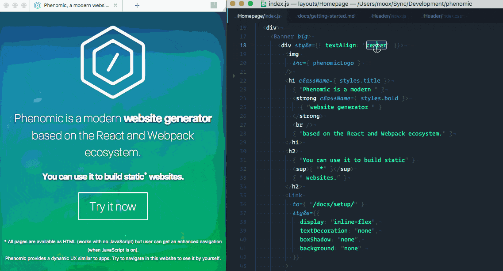

  

<a href="https://gitter.im/MoOx/phenomic">
  💬 Support Chat
</a>
|
<a href="https://twitter.com/Phenomic_app">
  Twitter
</a>
|
<a href="https://github.com/MoOx/phenomic">
  GitHub
</a>
|
<a href="https://gitlab.com/MoOx/phenomic">
  GitLab
</a>
|
<a href="https://bitbucket.org/MoOx/phenomic">
  BitBucket
</a>

> Modern website generator based on the React and Webpack ecosystem.

---

### ❓ [What is Phenomic?](https://phenomic.io/)

### 🚀 [How to setup Phenomic?](https://phenomic.io/docs/setup/)

### 🤔 [How to get started with Phenomic?](https://phenomic.io/docs/getting-started/)

### 🛠 [Usage documentation](https://phenomic.io/docs/usage/)

### ⁉️ [FAQ](https://phenomic.io/docs/faq/)

---

### 👀 [Who is using Phenomic?](https://phenomic.io/showcase/)

### 😍 [I am using Phenomic and I like it!](https://phenomic.io/showcase/submit/)

---

### 💬 [Community support chat](https://gitter.im/MoOx/phenomic)

### 🚨 [Follow @Phenomic_app on Twitter for latest news!](https://twitter.com/Phenomic_app)

---

🍭 For offline documentation, please check [`phenomic/docs/content`](docs/content).

---

## CONTRIBUTING

* ⇄ Pull/Merge requests and ★ Stars are always welcome.
* For bugs and feature requests, please [create an issue](https://github.com/MoOx/phenomic/issues/new).
* Pull requests must be accompanied by passing automated tests (`npm test`).

## Backers

[Become a backer]((https://opencollective.com/phenomic#backer)) and show your support for our open source project.

## Sponsors

Does your company use Phenomic?  Ask your manager or marketing team if your company would be interested in supporting our project.  Support will allow the maintainers to dedicate more time for maintenance and new features for everyone.  Also, your company's logo will show [on GitHub](https://github.com/MoOx/phenomic#readme)--who doesn't want a little extra exposure?  [Here's the info](https://opencollective.com/phenomic#sponsor).

## [CHANGELOG](CHANGELOG.md)

## [LICENSE](LICENSE)
