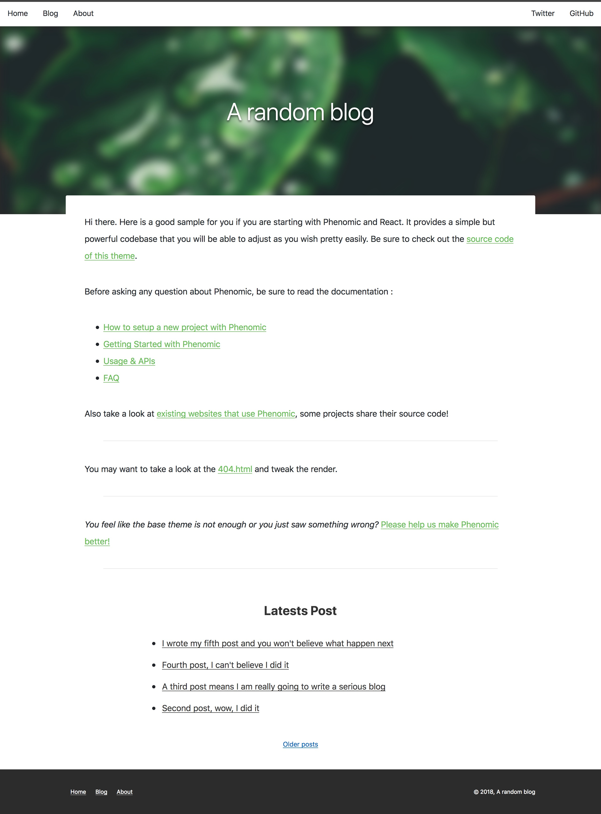

# Blog with Phenomic + React preset

Simple blog template that includes:

- some pages (home, about, 404.html for static hosting)
- a paginated list of posts
- some articles
- a component to display latest posts
- a loading indicator that is pretty sweet (and only appear when connection is
  "slow")
- a way to use different layout from markdown file (via front-matter
  `layout: {name}`)

Inspired by the Getting Started guide with a bit of CSS.

